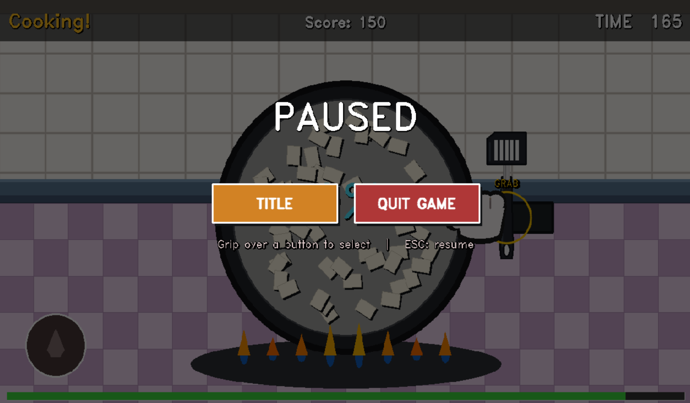

# 🍳 Cooking Papa

웹캠과 손 동작만으로 즐기는 AR 요리 게임입니다. 키보드나 마우스 없이, 카메라 앞에서 손을 쥐었다 펴는 동작만으로 재료를 자르고, 섞고, 뒤집고, 플레이팅까지 합니다.

**직접 플레이 해보시는 것을 추천드립니다.**

[](https://youtu.be/rqzNLpTx-Jo)

> 🎬 위 썸네일을 클릭하면 데모 영상(https://youtu.be/rqzNLpTx-Jo)으로 이동합니다.

---

## 1. 프로젝트 소개

`Cooking Papa`는 OpenCV로 받아온 웹캠 영상 위에 게임 화면을 합성하고, MediaPipe로 손 랜드마크를 추출해 플레이어의 손동작(쥐기/펴기, 위치, 속도, 깊이)을 실시간으로 추적하여 진행하는 **순수 Python 기반의 AR 쿠킹 게임**입니다.

- Unity나 외부 게임 엔진 없이, `python main.py` 한 줄로 바로 실행됩니다.
- 손의 2D 위치뿐 아니라 손바닥 크기 변화로 카메라와의 거리(깊이, Z)까지 추정해, "손을 앞으로 내밀기/뒤로 빼기" 같은 입체적인 동작도 인식합니다.
- 두 가지 미니게임(함박 스테이크 굽기, 팬케이크 만들기)을 제공하며, 각 게임은 여러 단계(자르기 → 굽기 → 양념 섞기 → 플레이팅 등)로 구성됩니다.
- 양파, 고기, 팬케이크, 시럽 등 모든 그래픽을 실제 음식처럼 보이도록 색감·형태·각도를 세밀하게 다듬어, 화면 가득 음식이 채워지는 "쿠킹 마마" 특유의 비주얼을 구현했습니다(예: 후라이팬 크기 조정, 팬케이크 시럽 흐르는 각도 보정, 스테이지 선택 카드 배경 정리 등).
- 타이틀 화면에 딸기, 브로콜리, 그리고 "Cooking Papa" 캐릭터를 직접 그려 넣어(`_draw_strawberry`, `_draw_broccoli`, `_draw_cooking_papa`) 딱딱할 수 있는 요리 게임 화면에 귀여운 분위기를 더했습니다.
- 게임 내내 잔잔한 배경음악(BGM)이 낮은 볼륨으로 깔리고, 각 조리 동작(굽기, 섞기, 가는 소리, 시럽 뿌리기 등)에는 그 상황에 맞는 루프 효과음이 더해져 실제로 요리하는 듯한 몰입감을 줍니다.

## 2. 개발 계기

웹캠을 활용한 손동작으로 어떤 게임을 즐길 수 있을까 고민하다가, 손짓만으로 플레이할 수 있는 "쿠킹마마"가 떠올랐습니다. 웹캠 앞에서 허우적허우적 손을 휘두르는 친구들의 모습을 상상하니 웃음이 나올 것 같아서 바로 제작을 진행하게 되었습니다. 실제로 친구가 플레이하는 모습을 지켜볼 때도 깔깔깔 웃을 수밖에 없었습니다.

## 3. 개발 과정에서 고려했던 것들

- **Unity → 순수 Python으로의 전환**: 처음에는 Unity로 3D 그래픽을 살린 쿠킹 게임을 만들려고 했습니다. 하지만 손 추적 결과를 Python에서 UDP로 Unity에 전송하는 방식은 통신 지연(latency)과 패킷 손실 문제가 있었고, 여기에 웹캠의 카메라 FPS 한계까지 겹치면서 손동작이 매끄럽게 반영되지 않아 "손으로 직접 조작하는" 게임 경험을 구현하기 어려웠습니다. 그래서 그래픽 퀄리티를 다소 포기하더라도, 영상 입력부터 손 인식·렌더링까지 모두 한 프로세스 안에서 처리하는 **순수 Python + OpenCV** 구조로 전환해 지연과 동기화 문제를 근본적으로 해결하는 쪽을 선택했습니다. 이 시기에 작업했던 Unity 프로젝트의 흔적은 저장소의 [`AR-cooking-mama/`](AR-cooking-mama/) 폴더에 그대로 남아 있습니다(현재 게임 실행에는 사용되지 않는 이전 시도의 기록입니다).
- **사용자 테스트 기반의 유저 친화적 설계**: 여러 사람에게 직접 플레이해보게 하면서 피드백을 받았고, 그 과정에서 나온 불편한 점들(손이 인식되지 않을 때 답답함, 의도치 않은 버튼 클릭, 진행 상황을 알기 어려움, 사운드 미설정으로 인한 피드백 누락 등)을 하나씩 게임에 반영했습니다. 그 결과물이 아래 [오류·사용자 실수를 줄이기 위해 세심하게 신경 쓴 부분들](#10-오류사용자-실수를-줄이기-위해-세심하게-신경-쓴-부분들) 섹션에 정리된 기능들입니다.

## 4. 시스템 아키텍처

### 데이터 흐름
```
웹캠 입력 (cv2.VideoCapture)
   → 프레임 전처리 (좌우 반전 / 리사이즈)
   → MediaPipe HandLandmarker (손 랜드마크 추출, LIVE_STREAM 모드)
   → hand_tracker.py
       핀홀 카메라 투영 → 깊이(Z) 추정 → 칼만 필터(속도 추적) → 그립 판정
       ⇒ HandState (위치·속도·깊이·그립 여부)
   → GameManager (상태 머신)
       SOUND_NOTICE → TUTORIAL → MENU → STAGE_SELECT → COUNTDOWN
       → PLAYING ⇄ PAUSED → RESULT → NAME_INPUT → GAME_OVER → RANKING
   → CookingScene / PancakeScene (미니게임 단계별 판정 + 점수 이벤트 발생)
   → 렌더링(OpenCV 드로잉) + 오디오(pygame.mixer) 동시 출력
   → cv2.imshow로 화면 표시
```

매 프레임마다 위 파이프라인이 한 번씩 돌며, 영상 입력부터 손 인식·게임 로직·렌더링·오디오까지 **하나의 Python 프로세스 안에서 순차적으로 처리**됩니다(외부 통신이나 별도 엔진을 거치지 않음).

### 모듈 구조
```
main.py                  — 카메라 자동 탐색, 메인 루프
game/
 ├ hand_tracker.py       — MediaPipe 래핑 + 핀홀 투영 / 깊이 추정 / 칼만 필터 / 그립 판정
 ├ game_manager.py       — 상태 머신, 메뉴·일시정지·결과·랭킹 화면, 점수 집계
 ├ cooking_scene.py      — 함박 스테이크 굽기 미니게임 로직 (CookingScene)
 ├ pancake_scene.py      — 팬케이크 만들기 미니게임 로직 (PancakeScene)
 ├ minigames/base.py     — 미니게임 공통 베이스 클래스(타이머, 진행도, 페이즈 디스패치)
 ├ audio.py              — 효과음·BGM·루프 사운드 재생, 합성 톤 폴백
 └ ui.py                 — 공용 드로잉 유틸리티
```

## 5. 기술 스택

| 영역 | 사용 기술 |
|---|---|
| 영상 입력/합성 | OpenCV (`cv2.VideoCapture`, 프레임 합성·드로잉) |
| 손 인식 | MediaPipe HandLandmarker (LIVE_STREAM 모드) |
| 오디오 | pygame.mixer (효과음, BGM, 루프 사운드, 합성 톤 폴백) |
| 수치 연산 | NumPy |
| 언어 | Python 3 (외부 엔진 없음) |

설치 및 실행:
```bash
pip install -r requirements.txt
python main.py
```

`main.py`는 0~2번 카메라 인덱스를 순서대로 시도해 정상적으로 프레임을 읽을 수 있는 첫 번째 장치를 자동으로 선택합니다(해상도 640x480, 60fps로 설정). 카메라를 찾지 못하면 "다른 프로그램이 웹캠을 쓰고 있지 않은지 확인하라"는 안내 메시지를 출력하고 안전하게 종료합니다.

## 6. 손 인식 핵심 기술

`game/hand_tracker.py`는 다음과 같은 컴퓨터 비전 기법들을 조합해 손동작을 정밀하게 추적합니다.

- **핀홀 카메라 투영 모델**: 정규화된 손 랜드마크 좌표를 `fx = PROC_W * 0.87`과 주점(principal point) `cx, cy`를 이용해 카메라 좌표계의 "월드" 좌표로 변환합니다(`_to_world`).
- **깊이(Z) 추정**: 손바닥의 실제 크기와 화면에 비친 픽셀 크기의 비율로 거리를 역산하는 핀홀 공식 `Z = fx × 손바닥_실제크기 / 손바닥_픽셀크기`를 그대로 사용합니다(`_calc_depth`). 이를 통해 "손이 카메라에 가까워졌는지/멀어졌는지"를 판단합니다.
- **칼만 필터(Kalman Filter)**: `cv2.KalmanFilter(4,2)`로 손의 속도를 부드럽게 추적해 흔들림(노이즈)을 줄입니다(`_VelocityTracker`).
- **그립(쥐기) 판정**: 손가락 끝과 PIP 관절의 y좌표 비교 + 손바닥 거리 임계값을 조합해 "손을 쥐었는지"를 판정합니다(`_calc_grip`). 이 그립 동작이 게임 내 모든 상호작용(도구 잡기, 버튼 선택, 재료 조작)의 기본 입력입니다.

## 7. 게임 진행 흐름 (상태 머신)

`GameManager`가 다음과 같은 상태들을 순서대로 전환하며 전체 게임을 관리합니다.

```
SOUND_NOTICE → TUTORIAL → MENU → STAGE_SELECT → COUNTDOWN → PLAYING
   → RESULT → NAME_INPUT → GAME_OVER → RANKING
                         ↕ (ESC)
                      PAUSED
```

- **SOUND_NOTICE**: 게임 시작 시 "스피커를 켜주세요" 안내를 3초간 보여줍니다.
- **TUTORIAL**: 손을 쥐는 법 등 기본 조작을 그림과 함께 설명합니다.
- **MENU**: START / TUTORIAL / EXIT 세 버튼이 있는 타이틀 화면입니다.
- **STAGE_SELECT**: 함박 스테이크 굽기 / 팬케이크 만들기 중 하나를 선택합니다.
- **COUNTDOWN → PLAYING**: 카운트다운 후 선택한 미니게임이 시작됩니다.
- **PAUSED**: 플레이 중 ESC를 누르면 일시정지되어 "TITLE로 돌아가기" / "게임 종료" 두 버튼이 나타납니다.
- **RESULT → NAME_INPUT → GAME_OVER → RANKING**: 결과 확인, 이름 입력, 최종 화면, 랭킹 보드로 이어집니다.

## 8. 미니게임 소개

함박 스테이크 굽기는 원작 "쿠킹마마" 시리즈의 미니게임 구성과 진행 방식을 많이 참고해 만들었고, 팬케이크 만들기는 그 틀에서 벗어나 저희가 독자적으로 설계한 시스템입니다. 손짓만으로도 서로 다른 종류의 미니게임을 다양하게 즐길 수 있도록, 두 게임의 입력 방식과 판정 로직을 의도적으로 다르게 디자인했습니다(예: 함박 스테이크는 자르기·젓기·뒤집기 같은 직접적인 동작 재현 위주, 팬케이크는 신호등 타이밍·궤적 그리기 같은 독자적인 리듬·정밀도 기반 동작 위주).

### 🥩 함박 스테이크 굽기 (`CookingScene`)
양파 손질부터 다짐육 반죽, 패티 굽기까지 이어지는 긴 요리 과정을 순서대로 진행합니다. 각 단계는 손으로 직접 "자르기(cut)", "젓기(stir)", "뒤집기(flip)" 같은 동작을 해야 통과되며, 동작 판정에 맞춰 효과음과 점수가 함께 따라옵니다.

1. **양파 올리기 (place_onion)** — 도마 위에 양파를 올려놓습니다.
2. **양파 껍질 까기 (peel_skin)** — 손동작으로 양파 껍질을 벗깁니다.
3. **양파 채 썰기 (slice_onion)** — 손을 휘둘러 양파를 썹니다.
4. **양파 깍둑썰기 (dice_onion)** — 썰어낸 양파를 잘게 다집니다.
5. **그릇에 담기 (bowl_drop)** — 다진 양파 조각들을 손으로 집어 그릇에 옮겨 담습니다(목표 개수만큼 채워야 통과).
6. **양파 볶기 (onion_fry)** — 팬 위에서 양파를 저어가며 볶고, 다 익으면 불 조절 버튼을 잡아 마무리합니다.
7. **고기 갈기 (meat_mix)** — 손잡이를 잡고 돌려 다짐육을 만듭니다(전용 "가는 소리" 효과음 재생).
8. **반죽하기 (knead)** — 볶은 양파를 다짐육에 부어 넣고, 화살표 동작과 손을 둥글게 돌리는 동작으로 반죽을 치댑니다("섞는 소리" 루프 재생).
9. **패티 만들기 (toss_meat)** — 반죽을 손으로 던지고 받으며 패티 모양을 잡습니다.
10. **함박 스테이크 굽기 (cook_steak)** — 팬 흔들기(shake), 스테이크 누르기(press), 뒤집기(flip), 불 조절(flame) 등 여러 동작을 순서대로 수행하며 굽습니다.
11. **완성 (reveal)** — 완성된 함박 스테이크 요리가 화면 가득 클로즈업으로 공개됩니다.

### 🥞 팬케이크 만들기 (`PancakeScene`)
달걀 분리부터 반죽 섞기, 굽기, 쌓기, 시럽 뿌리기까지 이어지는 요리 과정을 순서대로 진행합니다. 각 단계의 성공적인 동작(`crack`, `mix`, `flip`, `serve`, `stack`, `drizzle`)마다 즉시 점수가 누적되어, 진행 중에도 실시간으로 점수가 오르는 것을 체감할 수 있습니다.

1. **달걀 분리하기 (egg_separate)** — 손동작으로 달걀을 깨서 노른자와 흰자를 분리합니다(목표 2개, `crack` 이벤트 발생).
2. **반죽 만들기 (mixer)** — 밀가루, 우유, 설탕, 베이킹파우더, 버터, 머랭 등 6가지 재료를 차례로 그릇에 넣고 휘젓습니다. 신호등(초록/주황/빨강)이 바뀌는 타이밍에 맞춰 재료를 넣어야 하며, 신호 색에 따라 손을 휘젓는 속도(휘핑 속도)도 달라집니다(`mix` 이벤트).
3. **팬케이크 굽기 & 뒤집기 (cook_pancake)** — 반죽을 팬에 올려 구운 뒤, 적절한 타이밍에 손목을 위로 튕겨 팬케이크를 뒤집고(`flip`), 다 구워지면 접시로 옮겨 담습니다(`serve`).
4. **쌓아 올리기 (stack_pancake)** — 구워낸 팬케이크 여러 장을 손으로 집어 차곡차곡 쌓아 올립니다(`stack`).
5. **시럽 뿌리기 (syrup)** — 손을 움직여 시럽을 그리듯 뿌립니다. 일정 길이만큼 그릴 때마다 단계별로 `drizzle` 이벤트가 발생하며 점수가 추가됩니다.
6. **완성 (reveal)** — 시럽까지 올라간 완성된 팬케이크 요리가 화면 가득 클로즈업으로 공개됩니다.

## 9. 점수·랭킹·일시정지

- **실시간 점수 시스템**: 각 미니게임에서 동작이 성공할 때마다(자르기, 섞기, 뒤집기, 쌓기, 시럽 뿌리기 등) 이벤트가 발생하고, 이벤트 종류별로 정해진 점수가 즉시 누적됩니다. 미니게임을 완주하면 추가 완료 보너스도 더해집니다.
- **랭킹 보드 (RANKING)**: 게임이 끝나면 `NAME_INPUT` 단계에서 이름을 입력받아 점수와 함께 기록하고, `RANKING` 화면에서 역대 기록과 비교해 자신의 순위를 확인할 수 있습니다. 기록은 점수 순으로 정렬되어 메뉴별로(`rankings_steak.json` / `rankings_pancake.json`) 상위 10개까지 저장되며, **같은 이름으로 여러 번 기록해도 그중 가장 높은 점수 하나만 남도록 중복 제거**됩니다(`score_manager.py`의 `save()`). 같은 사람이 재도전해 더 높은 점수를 내면 이전 기록이 자동으로 갱신되어, 랭킹판이 같은 이름으로 도배되지 않고 항상 "자신의 최고 기록"만 남습니다.
- **일시정지 (PAUSED)**: 플레이 중 언제든 ESC 키로 일시정지할 수 있으며, "TITLE(타이틀로 돌아가기)" / "QUIT GAME(게임 종료)" 두 가지 선택지를 제공합니다. 일시정지 중에는 게임 화면과 타이머가 그대로 멈춰서, 자리를 비우거나 잠시 쉬어도 진행 중인 기록(점수·남은 시간)이 영향을 받지 않습니다.

  
  > 일시정지 화면 — 점수와 남은 시간이 멈춘 채로 고정되고, 손을 버튼 위에 올려 그립한 채 유지하면 선택됩니다.

## 10. 오류·사용자 실수를 줄이기 위해 세심하게 신경 쓴 부분들

이 프로젝트는 "마우스/키보드 없이 손동작만으로 플레이"하는 특성상, 일반적인 UI보다 훨씬 더 **오작동·오인식·사용자 실수의 여지**가 큽니다. 이를 줄이기 위해 다음과 같은 장치들을 추가했습니다.

#### ① 사운드 안내 화면 (SOUND_NOTICE)
게임을 시작하자마자 "스피커를 켜주세요" 화면을 띄워, 효과음과 음악을 듣지 못해 게임의 피드백(성공/실패 사운드, 진행 신호음 등)을 놓치는 일을 방지합니다.

#### ② 튜토리얼 단계
손을 쥐는 동작 등 게임의 기본 조작을 실제 플레이 전에 그림으로 미리 보여주어, 본 게임에서 "어떻게 조작하는지 몰라서" 발생하는 실수를 줄입니다. 메뉴에서 언제든 다시 볼 수 있습니다.

#### ③ "꾹 누르기(grip-hold)" 방식의 버튼 선택
손 인식은 미세하게 흔들리거나 순간적으로 오인식될 수 있기 때문에, 메뉴/스테이지 선택/일시정지 화면의 모든 버튼은 **손을 버튼 위에 올리고 일정 프레임(약 22프레임) 동안 계속 쥐고 있어야** 활성화됩니다(`_menu_btn_hold`, `_stage_btn_hold`, `_pause_btn_hold`). 진행 정도는 게이지로 화면에 표시되어, 손을 스쳐 지나가다 의도치 않게 버튼이 눌리는 사고를 방지합니다.

#### ④ 일시정지 + 타이머 완전 정지
플레이 중 ESC를 누르면 게임이 멈추고 "타이틀로" / "게임 종료" 두 버튼이 나타납니다. 단순히 화면만 멈추는 것이 아니라, **일시정지 화면이 떠 있는 동안 매 프레임마다 내부 타이머의 시작 시각을 함께 뒤로 밀어주어**(`extend_start_time`) 표시되는 남은 시간이 단 1초도 줄어들지 않도록 했습니다. (최초 구현 시 정지 화면에서도 카운트다운이 실시간으로 줄어드는 문제가 있었는데, 매 프레임 보정 방식으로 변경하여 드리프트 없이 완전히 멈추도록 수정했습니다.)

#### ⑤ ESC로 언제든 빠져나가기
- 스테이지 선택 화면에서 ESC → 타이틀로 복귀
- 플레이 중 ESC → 일시정지(타이틀로 가기 / 게임 종료 선택)

손동작 인식이 의도대로 되지 않아 게임에 갇힌 듯한 상황에서도, 키보드로 즉시 빠져나갈 수 있는 탈출구를 항상 열어두었습니다.

#### ⑥ 모든 주요 상호작용에 대한 즉각적인 오디오 피드백
타이틀의 START/TUTORIAL/EXIT 버튼, 스테이지 선택 카드, 일시정지 메뉴 버튼 등 손으로 선택하는 모든 UI 요소에 "잡기(grab)" 효과음을 재생합니다. 화면을 보지 않고도 "내 동작이 인식되어 선택이 이루어졌는지"를 소리로 확인할 수 있어, 같은 버튼을 반복해서 누르는 실수를 줄여줍니다.

#### ⑦ 오디오 폴백(합성 톤) 시스템
효과음 파일(`success.mp3`, `success.ogg` 등)을 찾지 못하거나 로드에 실패해도, NumPy로 직접 합성한 사인파 톤(`_tone`, `_make_tone_sound`)으로 대체 재생됩니다. 즉, 사운드 리소스가 일부 누락된 환경에서도 게임이 무음으로 멈추거나 오류로 종료되지 않고, 항상 어떤 형태로든 피드백 사운드가 재생됩니다.

#### ⑧ 카메라 자동 탐색
`main.py`의 `open_camera()`는 0~2번 장치를 순서대로 열어보고, 실제로 프레임을 읽을 수 있는 첫 번째 카메라를 사용합니다. 노트북 내장캠과 외장 웹캠이 동시에 연결된 환경 등에서 "엉뚱한 카메라가 켜지는" 문제를 줄이고, 연결된 카메라가 없으면 사용자에게 "다른 프로그램이 카메라를 점유하고 있는지 확인하라"는 구체적인 안내를 출력합니다.

#### ⑨ 진행 중 실시간 점수 누적과 단계별 피드백
각 미니게임은 동작이 성공할 때마다(자르기, 섞기, 뒤집기, 쌓기, 시럽 뿌리기 등) 즉시 이벤트를 발생시켜 점수에 반영합니다. 게임이 끝나야만 점수를 알 수 있는 것이 아니라, 플레이 도중에도 "내가 지금 잘 하고 있는지"를 실시간으로 확인할 수 있어 사용자가 자신의 진행 상황을 오해하는 일을 줄입니다.

#### ⑩ 디버그 UI 정리
화면에 항상 떠 있던 단축키 안내(디버그 UI)는 출시 화면에서 제거해, 실제 플레이어가 불필요하거나 혼란을 줄 수 있는 정보를 보지 않도록 정리했습니다. 다만 디버그·테스트가 필요한 경우에는 게임 플레이 중 키보드의 **1~9 숫자 키**를 누르면 해당 번호에 대응하는 단계로 즉시 이동할 수 있어, 특정 단계만 빠르게 확인하고 싶을 때 처음부터 다시 플레이하지 않아도 됩니다(`jump_to_phase`).

## 11. 실행 방법

```bash
pip install -r requirements.txt
python main.py
```

웹캠이 켜지면 화면의 안내에 따라 손을 쥐었다 펴면서 메뉴를 선택하고, 원하는 요리를 골라 플레이하면 됩니다. 언제든 ESC 키로 일시정지하거나 이전 화면으로 돌아갈 수 있습니다.
